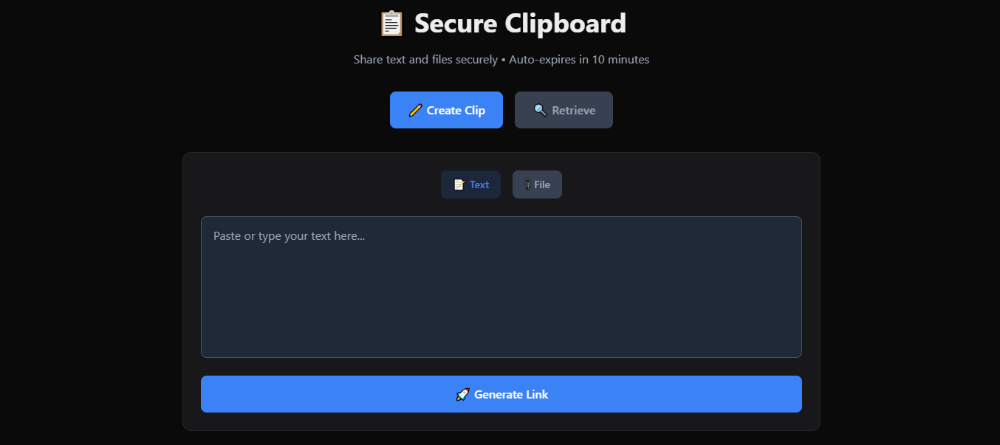
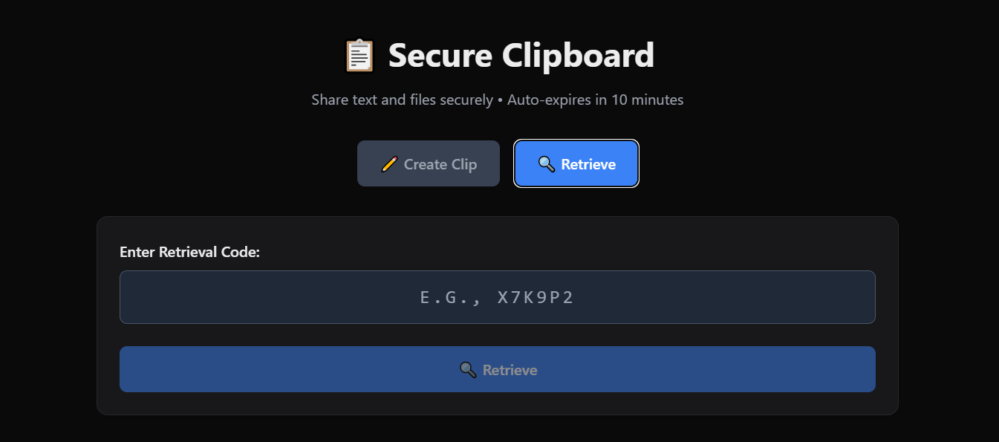

# 🔒 Secure Clipboard — Private Temporary Sharing

> Share text, code, and files securely with auto-expiry. No login. No tracking.

<p align="center">
  <a href="https://cliptamer.vercel.app/">
    
  </a>
</p>

---

## ⚡ Why this exists

Most clipboard tools store your data **forever**.

**Secure Clipboard fixes that.**

- Your data auto-deletes in **10 minutes**
- No accounts, no history, no tracking
- Built for **privacy-first sharing**

---

## 🌐 Live Demo

👉 **Try it now:**
🔗 [https://cliptamer.vercel.app/](https://cliptamer.vercel.app/)

---

## ✨ Features

- ⏱️ **Auto-Delete (10 min)** — Data is permanently erased
- 🔗 **Share via Link or Code**
- 📎 **Supports Files & Text (≤700KB)**
- 🔐 **Zero-Knowledge Approach**
- ⚡ **Fast (Edge + Redis)**
- 📱 **Mobile Friendly**
- 🌙 **Dark / Light Mode**

---

## 📸 Preview

### 🏠 Create Clip



### 🔍 Retrieve Clip



---

## 🧠 Tech Stack

- **Next.js 15 (App Router)**
- **Upstash Redis (Serverless)**
- **Tailwind CSS**
- **Vercel Deployment**
- **Bcrypt + Rate Limiting**

---

## 🚀 Run Locally

```bash
git clone https://github.com/HimanshuSaha9765/secure-clipboard.git
cd secure-clipboard
npm install
```

Create `.env.local`:

```env
UPSTASH_REDIS_REST_URL=your_url
UPSTASH_REDIS_REST_TOKEN=your_token
SESSION_SECRET=your_secret
```

Run:

```bash
npm run dev
```

Open: http://localhost:3000

---

## 🔐 Security Highlights

- Rate limiting (anti brute-force)
- HTTP-only cookies
- Redis TTL auto cleanup
- No logs / no tracking

---

## 📂 Structure

```
app/
lib/
public/
```

---

## 🌍 Visibility Tip

If you like this project, ⭐ star it and share it.

---

## 👨‍💻 Author

Himanshu Saha
GitHub: https://github.com/HimanshuSaha9765

---

<p align="center">
Built for privacy ⚡
</p>
